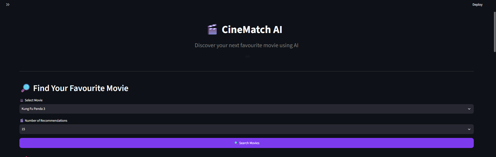
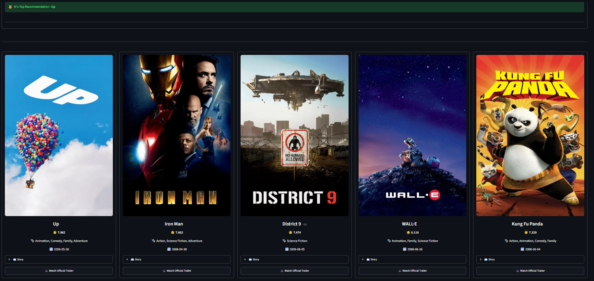
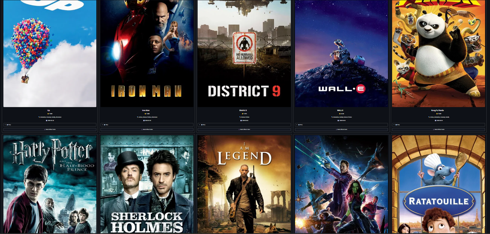
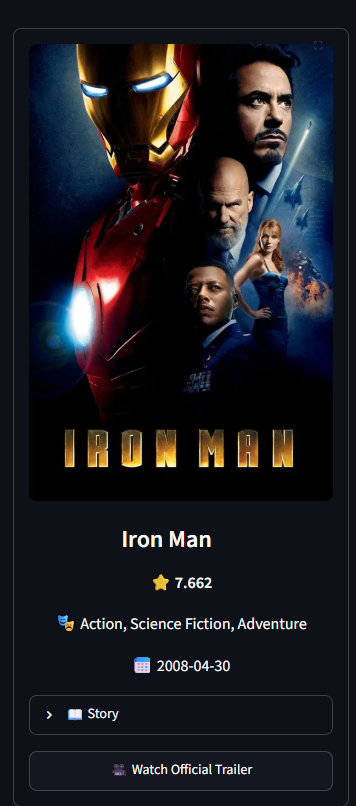
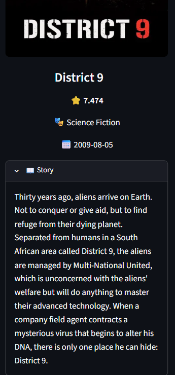

## 🌐 Live Demo

https://hybridmovierecommendationsystem-hhrtwftyyvmnew7bycezad.streamlit.app/

<div align="center">

# 🎬 CineMatch AI

### Hybrid Movie Recommendation System

Discover your next favourite movie using Artificial Intelligence.

Content-Based Filtering • Collaborative Filtering • TMDB API • Streamlit


</div>

---

# 📖 Overview

CineMatch AI is a **Hybrid Movie Recommendation System** that intelligently combines **Content-Based Filtering** and **Collaborative Filtering** to recommend movies similar to a user's interests.

The application also integrates the **TMDB API** to display rich movie information including:

- 🎬 Posters
- ⭐ Ratings
- 🎭 Genres
- 📅 Release Date
- ⏱ Runtime
- 📖 Story Overview
- ▶ Official Trailer

The project is built with **Python**, **Scikit-Learn**, and **Streamlit** to provide an interactive movie recommendation experience.

---

# ✨ Features

- 🎬 Hybrid Recommendation System
- 🤖 AI-Based Movie Suggestions
- 🥇 AI's Top Recommendation
- 🔢 Select 5 / 10 / 15 Recommendations
- 🖼 Movie Posters
- ⭐ IMDb Ratings
- 🎭 Genres
- 📅 Release Date
- ⏱ Runtime
- 📖 Story Overview
- ▶ Official Trailer
- 🌐 Interactive Streamlit Interface
- ⚡ Fast Recommendation Generation
- 🎨 Modern Netflix-Inspired UI

---

# 📸 Project Screenshots

## 🏠 Home Page



---

## 🎯 AI Recommendations



## 🎬 Multiple Recommendations



## 🎥 Movie Card



---

## 📖 Story Overview



---

# 🏗 System Architecture

```text
                    User

                      │

                      ▼

          Select Movie + Count

                      │

                      ▼

            Streamlit Web App

                      │

          ┌───────────┴───────────┐

          ▼                       ▼

  Content-Based            Collaborative

   Recommendation          Recommendation

          │                       │

          └───────────┬───────────┘

                      ▼

          Hybrid Recommendation

                      │

                      ▼

                 TMDB API

                      │

                      ▼

 Posters • Rating • Runtime • Trailer

                      │

                      ▼

          Final Recommendations
```

---

# 📊 Machine Learning Techniques

### Content-Based Filtering

Recommends movies based on movie metadata such as:

- Genres
- Keywords
- Cast
- Crew
- Overview

Uses:

- CountVectorizer
- Cosine Similarity

---

### Collaborative Filtering

Uses user rating similarity from MovieLens dataset.

---

### Hybrid Recommendation

Final Recommendation Score

```
60% Content-Based

+

40% Collaborative Filtering
```

This improves recommendation quality.

---

# 🛠 Tech Stack

### Programming

- Python

### Machine Learning

- Scikit-Learn

### Data Analysis

- Pandas
- NumPy

### API

- TMDB API

### Frontend

- Streamlit

### Version Control

- Git
- GitHub

---

# 📂 Project Structure

```text
Hybrid_Movie_Recommendation_System/

│

├── app.py

├── recommender.py

├── requirements.txt

├── README.md

│

├── models/

│ ├── movies.pkl

│ └── movie_mapping.pkl

│

├── notebooks/

│

├── data/

│

├── screenshots/

│ ├── home.png

│ ├── recommendations.png

│ ├── movie_card.png

│ ├── overview.png

│ └── loading.png
```

---

# 🚀 Installation

Clone Repository

```bash
git clone https://github.com/Arun-Code932/Hybrid_Movie_Recommendation_System.git
```

Go inside project

```bash
cd Hybrid_Movie_Recommendation_System
```

Install Dependencies

```bash
pip install -r requirements.txt
```

Run Application

```bash
streamlit run app.py
```

---

# ⚠ Model Files

The following large model files are **not included** in this repository because they exceed GitHub's file size limits.

- similarity.pkl
- collaborative_similarity.pkl

Generate them by running the notebooks in the `notebooks/` folder.

---

# 🚀 Future Improvements

- ⭐ User Login
- ❤️ Favourite Movies
- 📜 Search History
- 🎙 Voice Search
- 🔥 Trending Movies
- 🎭 Genre Filtering
- 👤 Personalized Recommendations
- 📱 Mobile Responsive UI
- 🌙 Dark / Light Theme
- ☁ Cloud Deployment

---

# 🌟 Project Highlights

✅ Hybrid Recommendation System

✅ Content-Based Filtering

✅ Collaborative Filtering

✅ Cosine Similarity

✅ TMDB API Integration

✅ Interactive Streamlit UI

✅ Dynamic Recommendation Count

✅ Movie Posters

✅ Runtime Badge

✅ Official Trailer

✅ Story Overview

✅ Netflix-Inspired Interface

---

# 🙏 Acknowledgements

- TMDB API
- MovieLens Dataset
- Streamlit
- Scikit-Learn
- Pandas
- NumPy

---

# 👨‍💻 Developer

## Arun Kumar

Machine Learning Enthusiast

GitHub:

https://github.com/Arun-Code932

---

<div align="center">

### ⭐ If you like this project, please consider giving it a Star ⭐

</div>
